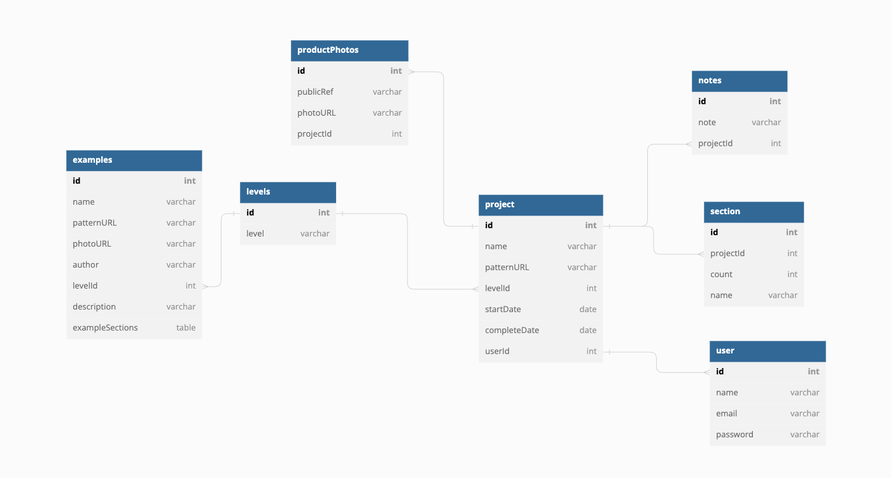

# Application Overview 
I love to crochet but it is easy to forget what row of my pattern I am on when I return to my work. I designed this app to track projects, keep a record of where I can find the pattern, and most importantly, help me track which row of the pattern I should start with when I return to my project. 

# Features 
* Users can add projects to their profile using the "Start a new projetc form" or use one of the examples on the home page. 
* Users can add notes to their projects to help remember and keep track of information 
* Users can add sections to their projects to keep count of different areas of their project. 
* Users can add photos to their finished projects 

# Planning 
* [ERD](https://dbdiagram.io/d/64090011296d97641d867efb)

# Home Page Preview 

# Current Project List Preview

# Complete Project List Preview

# Technologies Used 
* React 
* JavaScript 
* JSX 
* CSS 
* HTML 
* Cloudinary 
* Bulma 

# Installation 
 1. Be sure JSON server is installed 
    npm install -g json-server
2. You can access my database [here](https://github.com/amathews043/Front-End-Capstone-API) or you can create your own database.json file and serve it 
    json-server database.json -p 8088 -w
3. Clone the Application 
    git clone git@github.com:amathews043/Front-End-Capstone.git
4. Launch the Client 
    npm install 
    npm start